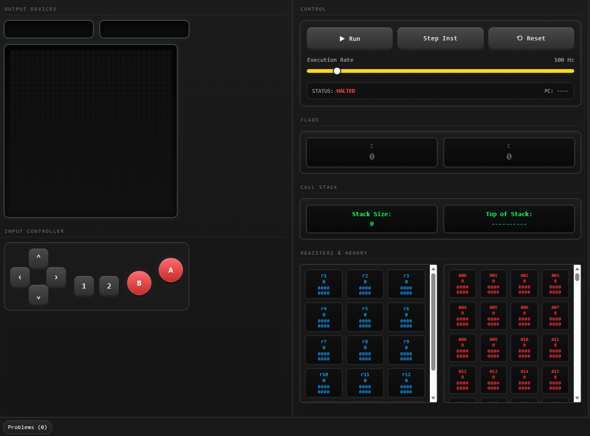
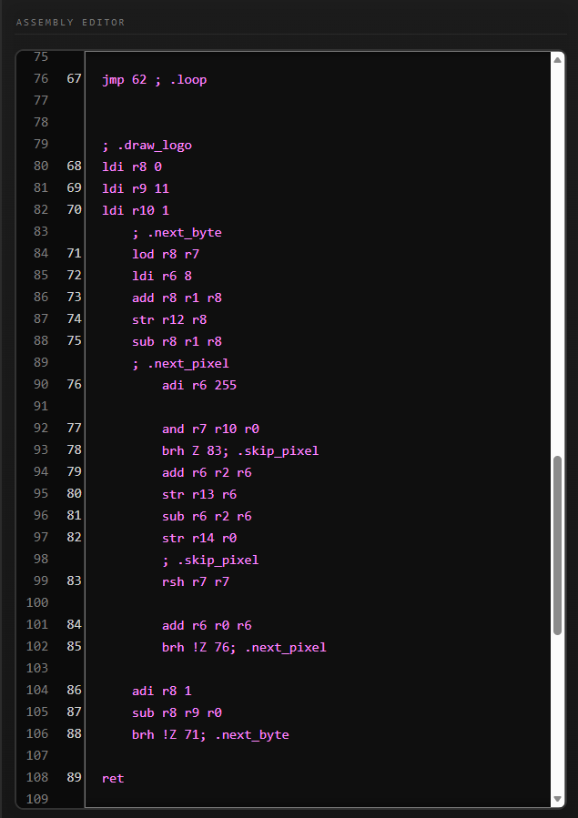
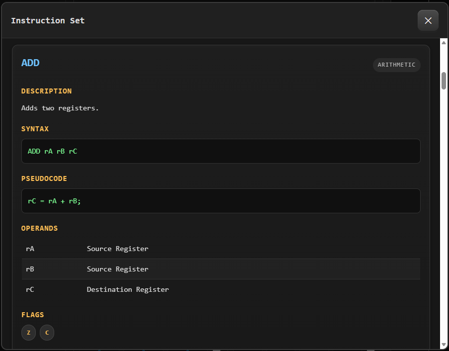
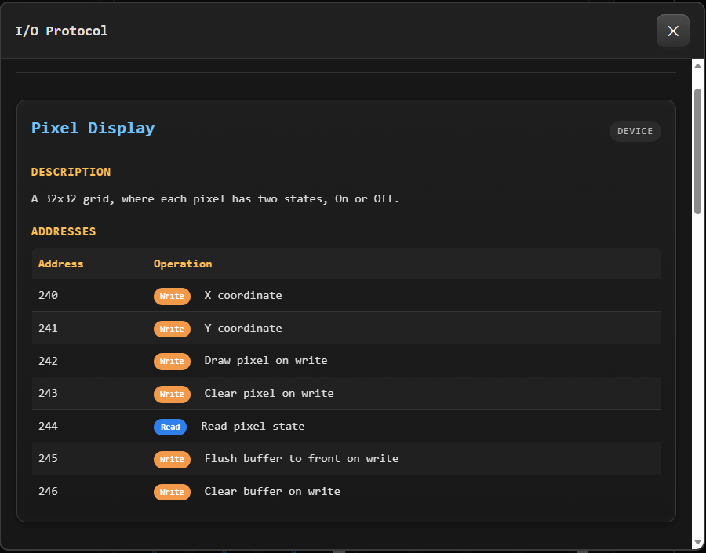
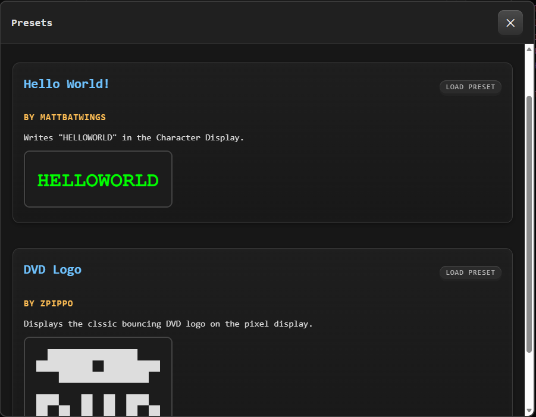

# BatPU Emulator - Web Port

*A browser-based emulator for the BatPU.*

Run programs, interact with virtual hardware devices in real time, and learn low-level computer architecture — all directly in your web browser.

---

## Main Emulator



## Writing and Running Programs



## Built-in ISA Documentation



## Built-in I/O Documentation



## Preset Programs



---

# Features

* Complete CPU virtual machine
* Built-in assembly editor
* Integrated assembler
* Run and step-through execution
* Adjustable execution speed
* Interactive Problems panel with assembler diagnostics
* Register viewer
* Data memory viewer
* Call stack viewer
* CPU status and Program Counter display
* Zero and Carry flag visualization
* Character display
* Signed/Unsigned number display
* 32×32 pixel display
* Virtual controller input
* Built-in Instruction Set (ISA) reference
* Built-in I/O protocol documentation
* Help guide
* Example programs with one-click loading
* Runs entirely inside the browser

---

# About

The BatPU Emulator is a browser implementation of the **BatPU VM** designed by **MattBatWings**.

The goal of this project was to create a browser-based version of the original application, for writing and running programs without needing to launch Minecraft. It also serves as a learning tool for understanding how a complete computer works at the hardware and assembly level.

This version of the emulator also comes with the full built-in CPU documentation and debugging tools to make writing programs much easier.

---

# Interface Overview

```
┌──────────────────────────────────────────────────────────────┐
│                      BatPU Emulator                          │
├──────────────┬─────────────────────┬─────────────────────────┤
│              │                     │                         │
│ Output       │ CPU Controls        │ Assembly Editor         │
│ Devices      │                     │                         │
│              │ Flags               │                         │
│ Controller   │ Call Stack          │                         │
│              │                     │                         │
│              │ Registers           │                         │
│              │ Data Memory         │                         │
│              │                     │                         │
├──────────────┴─────────────────────┴─────────────────────────┤
│ Problems │ ISA │ I/O │ Help │ Presets │ About │ Changelog    │
└──────────────────────────────────────────────────────────────┘
```

---

# Writing Programs

Programs are written directly in the built-in assembly editor.

Example:

```asm
; Count to 25

LDI r2 25
LDI r3 250
ADI r1 1
ADI r2 255
BRH !Z 2

STR r3 r1
HLT
```

Comments begin with a semicolon (`;`), two forward slashes (`//`), or a hashtag (`#`), and are ignored by the assembler.

The emulator can execute programs continuously or one instruction at a time for debugging.

---

# Included Hardware

The emulator reproduces the original VM's memory-mapped hardware devices.

## Output Devices

* 32×32 Pixel Display
* Character Display
* Number Display

## Input Devices

* Random Number Generator
* 8-button Virtual Controller

---

# Built-in Documentation

The emulator includes integrated documentation that can be accessed without leaving the application.

* Complete Instruction Set Architecture (ISA)
* I/O Protocol Reference
* Help Guide
* Preset Programs
* About Page
* Changelog

---

# Debugging Features

The emulator includes several tools to make developing assembly programs easier.

* Problems panel with assembler errors
* Panels showing the contents of the Register File
* Panels showing the contents of the Data Memory
* Call stack visualization
* CPU status display
* Program Counter display
* Zero and Carry flag status
* Single-step execution

---

# Preset Programs

Several example programs are included and can be loaded with a single click.

Current examples include:

* Hello World
* DVD Logo

More example programs will be added as the emulator continues to develop.

---

# Roadmap

## Completed

* CPU emulator
* Assembly editor
* Integrated assembler
* Register viewer
* Memory viewer
* Stack viewer
* Hardware devices
* Error reporting
* Documentation
* Preset programs

## Planned

* Syntax highlighting
* Save and load projects
* Improved debugging
* Additional preset programs
* Performance optimizations

---

# Credits

This project would not exist without the work of the following people.

### MattBatWings

Creator of the original BatPU CPU architecture, instruction set, I/O protocol, and educational series that inspired this emulator.

https://github.com/mattbatwings

---

### AdoHTQ

Created the original Virtual Machine that this project is based on.

https://github.com/AdoHTQ

---

### ArmadilloMike

Provided help and feedback during development.

https://github.com/ArmadilloMike

---

# Repository

GitHub:

https://github.com/Cheze-Burgur/BatPU-Emulator---Web-Port

---

# License

This project is licensed under the MIT License unless otherwise specified.

See the LICENSE file for details.
